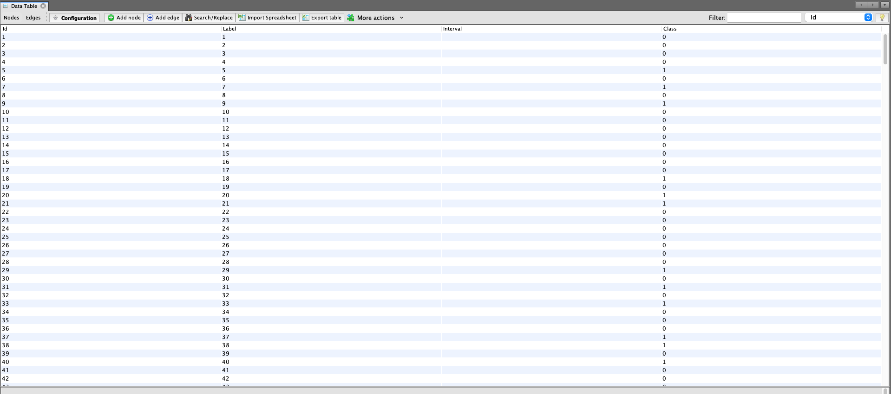
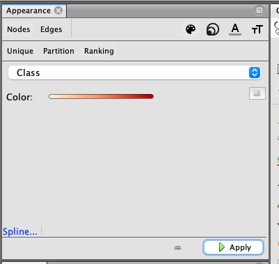

# SI
Visualiza where you are in the SI network.   

Creat a gephi file using this line: nx.write_gexf(G, "test.gexf"). 
Import "test.gexf" file into Gephi (this is a professional tool can be downloaded from https://gephi.org) and add class label to your nodes. After adding class label your data should look like this: 

In gephi work place, change node color according to class (SI/non-SI): , and change edge color accordding to weight: 
