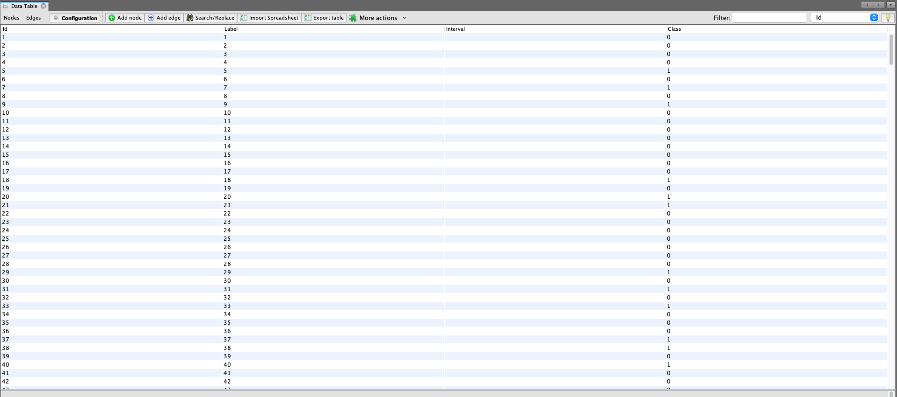
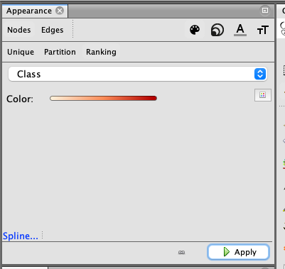
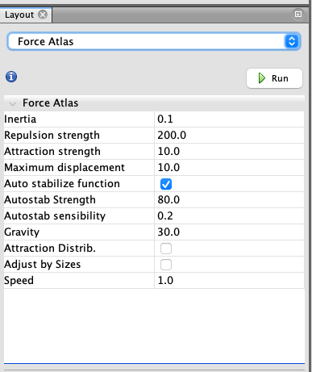
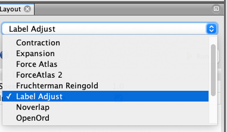
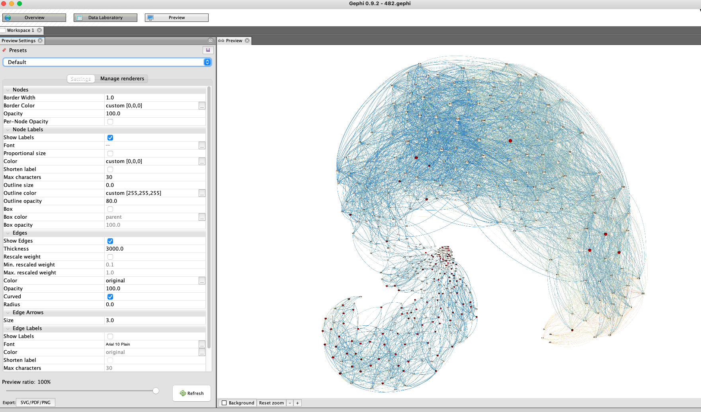

# SI
Visualiza where you are in the SI network, blue and yellow dots are patients without and with SI in our dataset.   

Creat a gephi file using this line: nx.write_gexf(G, "482.gexf"). 
Import "482.gexf" file into Gephi (this is a professional tool can be downloaded from https://gephi.org) and add class label (labels_482.npy) to your nodes. After adding class label your data should look like this: 

In gephi work place, change node color according to class (SI/non-SI):   
,   
and change edge color accordding to weight:   

Then adjust network shape using "Force Atlas", "Label adjust" and "non overlap":  
. 

Then expansion if needed. In preview, the network should look like this (yellow and red dots are patients without and with SI in our dataset):  

